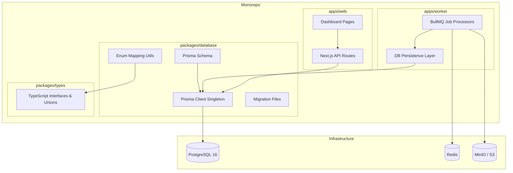
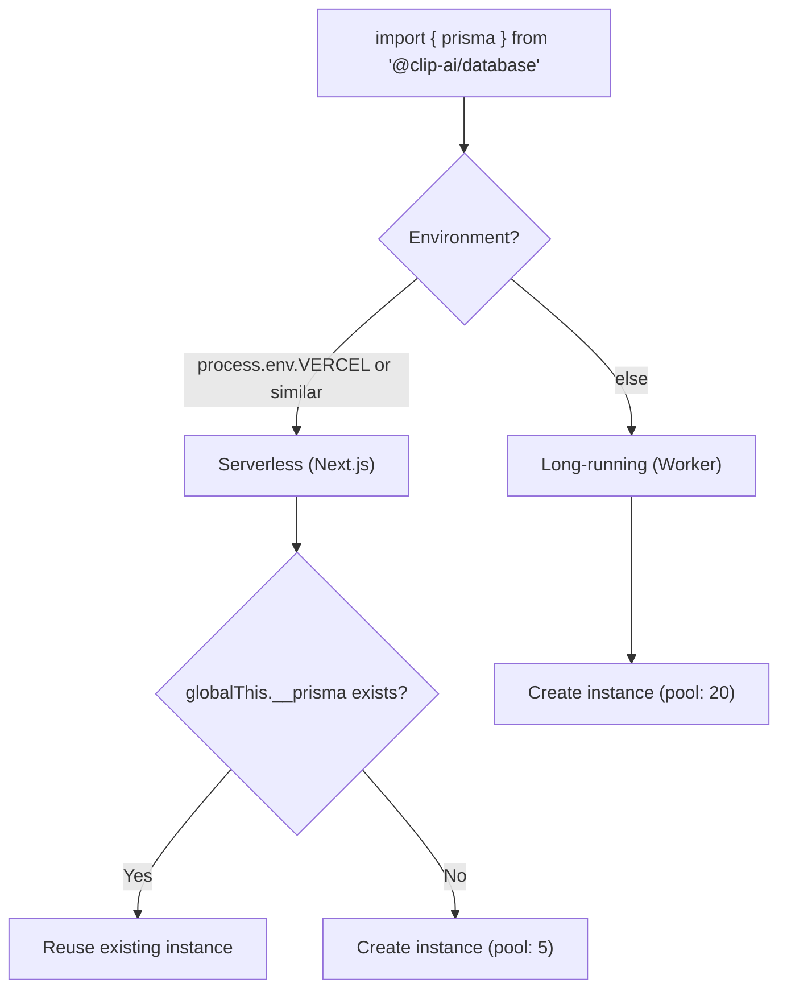

# Design Document: Database Persistence Layer

## Overview

This design introduces a PostgreSQL database with Prisma ORM as the persistence layer for the ClipAI monorepo. The `packages/database` package (`@clip-ai/database`) provides a shared Prisma client, schema, and migration infrastructure consumed by both `apps/web` (Next.js) and `apps/worker` (BullMQ).

The design maps the existing TypeScript types in `packages/types/src/` to a relational schema with proper foreign keys, indexes, cascading deletes, and check constraints. A singleton client pattern handles both serverless (Next.js API routes with connection pooling capped at 5) and long-running (worker with pool up to 20) environments.

Key design decisions:
- **Prisma over Drizzle/Knex**: Prisma provides auto-generated types, declarative schema, and built-in migration tooling that integrates well with monorepos.
- **JSON columns for metadata/settings**: Video metadata and clip settings are stored as typed JSON columns rather than separate tables, matching the existing flat interface structure and avoiding excessive joins.
- **Transcript text in DB, segments in S3**: Full text is stored in PostgreSQL for querying, while detailed word/segment arrays remain in S3 (referenced by `storageKey`) to keep row sizes manageable.
- **Job model mirrors BullMQ state**: The Job table acts as a read-friendly projection of BullMQ job state, updated by the worker on lifecycle events.

## Architecture



### Connection Strategy



## Components and Interfaces

### Package Structure (`packages/database`)

```
packages/database/
├── package.json
├── tsconfig.json
├── prisma/
│   ├── schema.prisma          # Schema definition
│   └── migrations/            # Generated migration SQL files
├── src/
│   ├── index.ts               # Main exports (client, types, utils)
│   ├── client.ts              # Singleton Prisma client factory
│   ├── enums.ts               # Enum mapping/validation utilities
│   └── types.ts               # Re-exported Prisma types
└── scripts/
    └── validate-enums.ts      # Build-time enum alignment check
```

### Exported Interface

```typescript
// packages/database/src/index.ts

// Singleton client instance
export { prisma } from './client';

// Prisma-generated types (re-exported for convenience)
export type {
  User,
  Video,
  Clip,
  Transcript,
  Export,
  Job,
  VideoMetadata,
  ClipSettings,
} from '@prisma/client';

// Enum types
export {
  VideoStatus,
  ClipStatus,
  JobStatus,
  JobType,
  Platform,
  CaptionStyle,
  CaptionAnimation,
  UserRole,
  UserPlan,
} from '@prisma/client';

// Enum mapping utilities
export { assertEnumAlignment } from './enums';
```

### Client Singleton (`src/client.ts`)

```typescript
import { PrismaClient } from '@prisma/client';

const globalForPrisma = globalThis as unknown as {
  __prisma: PrismaClient | undefined;
};

function createPrismaClient(): PrismaClient {
  const databaseUrl = process.env.DATABASE_URL;
  if (!databaseUrl) {
    throw new Error(
      '[database] DATABASE_URL environment variable is not set. ' +
      'Cannot initialize Prisma client without a connection string.'
    );
  }

  const isServerless = !!(
    process.env.VERCEL ||
    process.env.AWS_LAMBDA_FUNCTION_NAME ||
    process.env.SERVERLESS
  );

  const poolSize = isServerless
    ? Math.min(parseInt(process.env.DATABASE_POOL_SIZE || '5', 10), 5)
    : Math.min(parseInt(process.env.DATABASE_POOL_SIZE || '20', 10), 20);

  return new PrismaClient({
    datasources: {
      db: { url: databaseUrl },
    },
    log: process.env.NODE_ENV === 'development'
      ? ['query', 'warn', 'error']
      : ['warn', 'error'],
  });
}

function getClient(): PrismaClient {
  const isServerless = !!(
    process.env.VERCEL ||
    process.env.AWS_LAMBDA_FUNCTION_NAME ||
    process.env.SERVERLESS
  );

  if (isServerless) {
    if (!globalForPrisma.__prisma) {
      globalForPrisma.__prisma = createPrismaClient();
    }
    return globalForPrisma.__prisma;
  }

  // Long-running: single instance, no global caching needed
  return createPrismaClient();
}

export const prisma = getClient();
```

### Worker Persistence Service

```typescript
// apps/worker/src/lib/persistence.ts
import { prisma } from '@clip-ai/database';

export class PersistenceService {
  private readonly maxRetries = 3;
  private readonly baseDelay = 1000; // 1 second

  async withRetry<T>(operation: () => Promise<T>): Promise<T> {
    let lastError: Error | undefined;
    for (let attempt = 0; attempt < this.maxRetries; attempt++) {
      try {
        return await operation();
      } catch (error) {
        lastError = error as Error;
        if (attempt < this.maxRetries - 1) {
          const delay = this.baseDelay * Math.pow(2, attempt);
          await new Promise(resolve => setTimeout(resolve, delay));
        }
      }
    }
    throw lastError;
  }

  async onJobStart(jobId: string): Promise<void> { /* ... */ }
  async onJobComplete(jobId: string, result: unknown): Promise<void> { /* ... */ }
  async onJobFailed(jobId: string, error: string): Promise<void> { /* ... */ }
  async onJobProgress(jobId: string, progress: number): Promise<void> { /* ... */ }
  async createTranscript(data: CreateTranscriptInput): Promise<string> { /* ... */ }
  async createClips(data: CreateClipsInput): Promise<string[]> { /* ... */ }
  async createExport(data: CreateExportInput): Promise<string> { /* ... */ }
}
```

## Data Models

### Prisma Schema

```prisma
// prisma/schema.prisma

generator client {
  provider = "prisma-client-js"
}

datasource db {
  provider = "postgresql"
  url      = env("DATABASE_URL")
}

// ─── Enums ───────────────────────────────────────────

enum UserRole {
  user
  admin
}

enum UserPlan {
  free
  pro
  enterprise
}

enum VideoStatus {
  uploading
  uploaded
  processing
  transcribing
  analyzing
  ready
  error
}

enum ClipStatus {
  suggested
  queued
  rendering
  rendered
  exported
  error
}

enum JobType {
  transcribe
  detect_highlights   // maps to "detect-highlights"
  generate_captions   // maps to "generate-captions"
  render_clip         // maps to "render-clip"
  generate_preview    // maps to "generate-preview"
  extract_keyframes   // maps to "extract-keyframes"
  analyze_keyframes   // maps to "analyze-keyframes"
}

enum JobStatus {
  waiting
  active
  completed
  failed
  delayed
  paused
}

enum Platform {
  tiktok
  reels
  shorts
  twitter
  square
  landscape
}

enum CaptionStyle {
  bold
  karaoke
  minimal
  gradient
  outline
}

enum CaptionAnimation {
  fade
  pop
  slide
  typewriter
  none
}

// ─── Models ──────────────────────────────────────────

model User {
  id         String   @id @default(uuid()) @db.Uuid
  email      String   @unique @db.VarChar(254)
  name       String   @db.VarChar(100)
  avatarUrl  String?
  role       UserRole @default(user)
  plan       UserPlan @default(free)
  credits    Int      @default(10)
  totalClips Int      @default(0)
  createdAt  DateTime @default(now())
  updatedAt  DateTime @updatedAt

  videos Video[]
  clips  Clip[]

  @@check("credits_non_negative", "credits >= 0")
  @@check("total_clips_non_negative", "\"totalClips\" >= 0")
}

model Video {
  id           String      @id @default(uuid()) @db.Uuid
  userId       String      @db.Uuid
  originalName String      @db.VarChar(255)
  storageKey   String      @db.VarChar(1024)
  url          String?
  thumbnailUrl String?
  status       VideoStatus @default(uploading)
  metadata     Json?       // VideoMetadata shape
  error        String?     @db.Text
  tags         String[]    @default([])
  createdAt    DateTime    @default(now())
  updatedAt    DateTime    @updatedAt

  user       User        @relation(fields: [userId], references: [id])
  clips      Clip[]
  transcript Transcript?
  jobs       Job[]

  @@index([userId])
  @@index([status])
}

model Transcript {
  id             String   @id @default(uuid()) @db.Uuid
  videoId        String   @unique @db.Uuid
  text           String   @db.Text // max ~500K chars
  language       String   @db.VarChar(10)
  duration       Float
  segmentCount   Int
  wordCount      Int
  model          String   @db.VarChar(100)
  storageKey     String   @db.VarChar(512)
  processingTime Int      // milliseconds
  createdAt      DateTime @default(now())

  video Video @relation(fields: [videoId], references: [id], onDelete: Cascade)
}

model Clip {
  id             String     @id @default(uuid()) @db.Uuid
  videoId        String     @db.Uuid
  userId         String     @db.Uuid
  startTime      Float
  endTime        Float
  duration       Float
  hookText       String     @db.VarChar(500)
  reason         String     @db.VarChar(1000)
  viralityScore  Int
  tags           String[]   @default([])
  status         ClipStatus @default(suggested)
  settings       Json       // ClipSettings shape
  renderProgress Int?
  previewUrl     String?
  error          String?    @db.Text
  createdAt      DateTime   @default(now())
  updatedAt      DateTime   @updatedAt

  video   Video    @relation(fields: [videoId], references: [id], onDelete: Cascade)
  user    User     @relation(fields: [userId], references: [id])
  exports Export[]

  @@index([videoId])
  @@index([userId])
  @@index([status])
  @@check("start_before_end", "\"startTime\" < \"endTime\"")
  @@check("virality_range", "\"viralityScore\" >= 0 AND \"viralityScore\" <= 100")
}

model Export {
  id         String   @id @default(uuid()) @db.Uuid
  clipId     String   @db.Uuid
  platform   Platform
  url        String   @db.VarChar(2048)
  storageKey String   @db.VarChar(512)
  fileSize   BigInt   // bytes
  resolution String   @db.VarChar(20) // e.g. "1080x1920"
  exportedAt DateTime @default(now())

  clip Clip @relation(fields: [clipId], references: [id], onDelete: Cascade)

  @@unique([clipId, platform])
}

model Job {
  id          String    @id @default(uuid()) @db.Uuid
  type        JobType
  status      JobStatus @default(waiting)
  videoId     String?   @db.Uuid
  clipId      String?   @db.Uuid
  payload     Json
  result      Json?
  error       String?   @db.VarChar(2000)
  attempts    Int       @default(0)
  maxAttempts Int       @default(3)
  progress    Int       @default(0)
  priority    Int       @default(0)
  createdAt   DateTime  @default(now())
  startedAt   DateTime?
  completedAt DateTime?

  video Video? @relation(fields: [videoId], references: [id], onDelete: SetNull)
  clip  Clip?  @relation(fields: [clipId], references: [id], onDelete: SetNull)

  @@index([type])
  @@index([status])
  @@index([videoId])
}
```

### Enum Mapping Strategy

The `JobType` enum uses underscores in Prisma (PostgreSQL enum constraint) but the TypeScript types use hyphens. A mapping layer handles this:

```typescript
// packages/database/src/enums.ts
import { JobType as PrismaJobType } from '@prisma/client';
import type { JobType as TSJobType } from '@clip-ai/types';

const JOB_TYPE_MAP: Record<PrismaJobType, TSJobType> = {
  transcribe: 'transcribe',
  detect_highlights: 'detect-highlights',
  generate_captions: 'generate-captions',
  render_clip: 'render-clip',
  generate_preview: 'generate-preview',
  extract_keyframes: 'extract-keyframes',
  analyze_keyframes: 'analyze-keyframes',
};

const REVERSE_JOB_TYPE_MAP: Record<TSJobType, PrismaJobType> = Object.fromEntries(
  Object.entries(JOB_TYPE_MAP).map(([k, v]) => [v, k])
) as Record<TSJobType, PrismaJobType>;

export function toTSJobType(prismaType: PrismaJobType): TSJobType {
  return JOB_TYPE_MAP[prismaType];
}

export function toPrismaJobType(tsType: TSJobType): PrismaJobType {
  return REVERSE_JOB_TYPE_MAP[tsType];
}
```

All other enums (VideoStatus, ClipStatus, JobStatus, Platform, CaptionStyle, CaptionAnimation, UserRole, UserPlan) use identical string values in both Prisma and TypeScript, requiring only a type assertion.

### Build-Time Enum Validation Script

```typescript
// packages/database/scripts/validate-enums.ts
import * as PrismaEnums from '@prisma/client';
import * as TSTypes from '@clip-ai/types';

const ENUM_PAIRS = [
  { name: 'VideoStatus', prisma: Object.values(PrismaEnums.VideoStatus), ts: ['uploading','uploaded','processing','transcribing','analyzing','ready','error'] },
  { name: 'ClipStatus', prisma: Object.values(PrismaEnums.ClipStatus), ts: ['suggested','queued','rendering','rendered','exported','error'] },
  { name: 'JobStatus', prisma: Object.values(PrismaEnums.JobStatus), ts: ['waiting','active','completed','failed','delayed','paused'] },
  { name: 'Platform', prisma: Object.values(PrismaEnums.Platform), ts: ['tiktok','reels','shorts','twitter','square','landscape'] },
  { name: 'CaptionStyle', prisma: Object.values(PrismaEnums.CaptionStyle), ts: ['bold','karaoke','minimal','gradient','outline'] },
  { name: 'CaptionAnimation', prisma: Object.values(PrismaEnums.CaptionAnimation), ts: ['fade','pop','slide','typewriter','none'] },
  { name: 'UserRole', prisma: Object.values(PrismaEnums.UserRole), ts: ['user','admin'] },
  { name: 'UserPlan', prisma: Object.values(PrismaEnums.UserPlan), ts: ['free','pro','enterprise'] },
];

// JobType requires mapping (underscores vs hyphens)
// Validated separately via the mapping functions

let failed = false;
for (const { name, prisma, ts } of ENUM_PAIRS) {
  const prismaSet = new Set(prisma);
  const tsSet = new Set(ts);
  if (prismaSet.size !== tsSet.size || ![...prismaSet].every(v => tsSet.has(v))) {
    console.error(`ENUM MISMATCH: ${name}`);
    console.error(`  Prisma: ${[...prismaSet].join(', ')}`);
    console.error(`  Types:  ${[...tsSet].join(', ')}`);
    failed = true;
  }
}

if (failed) process.exit(1);
console.log('All enum alignments verified.');
```

### Entity Relationship Diagram

```mermaid
erDiagram
    User ||--o{ Video : owns
    User ||--o{ Clip : owns
    Video ||--o{ Clip : contains
    Video ||--o| Transcript : has
    Video ||--o{ Job : tracks
    Clip ||--o{ Export : produces
    Clip ||--o{ Job : tracks

    User {
        uuid id PK
        varchar email UK
        varchar name
        varchar avatarUrl
        enum role
        enum plan
        int credits
        int totalClips
        timestamp createdAt
        timestamp updatedAt
    }

    Video {
        uuid id PK
        uuid userId FK
        varchar originalName
        varchar storageKey
        varchar url
        varchar thumbnailUrl
        enum status
        json metadata
        text error
        text[] tags
        timestamp createdAt
        timestamp updatedAt
    }

    Transcript {
        uuid id PK
        uuid videoId FK_UK
        text text
        varchar language
        float duration
        int segmentCount
        int wordCount
        varchar model
        varchar storageKey
        int processingTime
        timestamp createdAt
    }

    Clip {
        uuid id PK
        uuid videoId FK
        uuid userId FK
        float startTime
        float endTime
        float duration
        varchar hookText
        varchar reason
        int viralityScore
        text[] tags
        enum status
        json settings
        int renderProgress
        varchar previewUrl
        text error
        timestamp createdAt
        timestamp updatedAt
    }

    Export {
        uuid id PK
        uuid clipId FK
        enum platform
        varchar url
        varchar storageKey
        bigint fileSize
        varchar resolution
        timestamp exportedAt
    }

    Job {
        uuid id PK
        enum type
        enum status
        uuid videoId FK
        uuid clipId FK
        json payload
        json result
        varchar error
        int attempts
        int maxAttempts
        int progress
        int priority
        timestamp createdAt
        timestamp startedAt
        timestamp completedAt
    }
```


## Correctness Properties

*A property is a characteristic or behavior that should hold true across all valid executions of a system — essentially, a formal statement about what the system should do. Properties serve as the bridge between human-readable specifications and machine-verifiable correctness guarantees.*

### Property 1: Clip time constraint enforcement

*For any* pair of float values (startTime, endTime) where startTime >= endTime, attempting to create a Clip record with those values SHALL be rejected by the database with a check constraint violation. Conversely, for any pair where startTime < endTime (both non-negative), the insertion SHALL succeed.

**Validates: Requirements 5.9**

### Property 2: Persistence retry with exponential backoff

*For any* sequence of database write outcomes (success or failure), the `withRetry` function SHALL: (a) return the result on the first successful attempt, (b) retry up to 3 times on failure with delays of 1s, 2s, 4s (exponential backoff), and (c) throw the last error if all 3 attempts fail. The number of actual invocations SHALL equal min(attempts_until_success, 3).

**Validates: Requirements 8.8**

### Property 3: Pagination metadata correctness

*For any* set of N video records belonging to a user and any requested page number P (1-indexed) with page size 20, the pagination response SHALL satisfy: (a) `data.length == min(20, N - (P-1)*20)` for valid pages, (b) `hasNext == (P * 20 < N)`, (c) `total == N`, and (d) records are ordered by createdAt descending.

**Validates: Requirements 9.1**

### Property 4: Enum mapping round-trip

*For any* valid TypeScript enum value from `@clip-ai/types` (across all enum types: JobType, VideoStatus, ClipStatus, JobStatus, Platform, CaptionStyle, CaptionAnimation, UserRole, UserPlan), converting to the Prisma representation and back SHALL produce the original value. Symmetrically, for any valid Prisma enum value, converting to the TypeScript representation and back SHALL produce the original value.

**Validates: Requirements 11.1, 11.3**

## Error Handling

### Database Connection Errors

| Scenario | Behavior |
|----------|----------|
| `DATABASE_URL` not set | Throw `Error` with message indicating missing variable at client instantiation time |
| Database unreachable (timeout 5s) | Throw `Error` with host and port in message |
| Connection pool exhausted | Prisma queues requests; if queue exceeds timeout, throws `PrismaClientKnownRequestError` with code `P2024` |
| Connection dropped mid-query | Prisma auto-reconnects on next query; in-flight query fails with retriable error |

### Constraint Violations

| Constraint | Error Code | Handling |
|-----------|-----------|----------|
| Unique email (User) | `P2002` | Return 409 Conflict with field name |
| Unique videoId (Transcript) | `P2002` | Return 409 Conflict |
| Unique clipId+platform (Export) | `P2002` | Upsert instead of insert (Req 6.4) |
| FK violation (non-existent parent) | `P2003` | Return 404 Not Found for the referenced entity |
| Check constraint (credits < 0) | `P2004` | Return 422 Unprocessable Entity with constraint name |
| Check constraint (startTime >= endTime) | `P2004` | Return 422 with validation message |

### Worker Persistence Failures

The `PersistenceService.withRetry()` method handles transient database failures:

1. **Attempt 1**: Execute operation immediately
2. **Attempt 2**: Wait 1 second, retry
3. **Attempt 3**: Wait 2 seconds, retry
4. **All failed**: Throw the last error, which triggers BullMQ's job-level retry mechanism

If the job-level retry also exhausts (3 attempts for standard jobs, 2 for render-clip), the job is marked as `failed` with the error message truncated to 2048 characters.

### Migration Failures

- The `db:migrate` script exits with code 1 on failure
- Error output includes the migration name and PostgreSQL error
- Failed migrations are not partially applied (Prisma uses transactions per migration)

## Testing Strategy

### Unit Tests (Example-Based)

Unit tests cover specific scenarios, defaults, and edge cases:

- **Client singleton behavior**: Verify global reuse in serverless mode, fresh instance in worker mode
- **Default values**: Verify all model defaults (User credits=10, Video status="uploading", etc.)
- **Constraint violations**: Verify unique email, unique videoId on Transcript, FK violations
- **Cascade behavior**: Verify Video deletion cascades to Clips/Transcript, Clip deletion cascades to Exports
- **SetNull behavior**: Verify Video/Clip deletion sets Job foreign keys to null
- **Environment validation**: Verify error thrown when DATABASE_URL missing
- **Upsert logic**: Verify Export upsert replaces existing record for same clipId+platform

### Property-Based Tests

Property-based tests verify universal invariants using `fast-check` (minimum 100 iterations per property):

| Property | Test Description | Library |
|----------|-----------------|---------|
| Property 1 | Generate random (startTime, endTime) pairs, verify constraint enforcement | fast-check |
| Property 2 | Generate random success/failure sequences, verify retry behavior | fast-check |
| Property 3 | Generate random video counts and page numbers, verify pagination metadata | fast-check |
| Property 4 | Enumerate all enum values, verify round-trip through mapping functions | fast-check |

**Configuration:**
- Library: `fast-check` (TypeScript-native, integrates with Vitest)
- Minimum iterations: 100 per property
- Tag format: `Feature: database-persistence-layer, Property {N}: {title}`

### Integration Tests

Integration tests run against a real PostgreSQL instance (Docker):

- **Worker persistence flow**: Simulate job lifecycle (start → progress → complete/fail), verify DB state
- **Cascade deletes**: Create full entity graph, delete root, verify cleanup
- **Concurrent access**: Verify connection pooling handles parallel requests
- **Migration smoke test**: Apply all migrations to fresh database, verify schema matches expectations

### Test Infrastructure

```
packages/database/
├── __tests__/
│   ├── unit/
│   │   ├── client.test.ts          # Singleton, env validation
│   │   ├── enums.test.ts           # Enum mapping, round-trips
│   │   └── pagination.test.ts      # Pagination logic
│   ├── property/
│   │   ├── clip-constraint.prop.ts # Property 1
│   │   ├── retry-logic.prop.ts     # Property 2
│   │   ├── pagination.prop.ts      # Property 3
│   │   └── enum-roundtrip.prop.ts  # Property 4
│   └── integration/
│       ├── models.test.ts          # CRUD + constraints
│       ├── cascades.test.ts        # Cascade/SetNull behavior
│       └── worker-persistence.test.ts
├── vitest.config.ts
└── docker-compose.test.yml         # Test-only PostgreSQL
```

**Test runner**: Vitest (already standard in the ecosystem, supports TypeScript natively)
**PBT library**: fast-check v3
**Database for tests**: Docker PostgreSQL container spun up via `docker-compose.test.yml`
