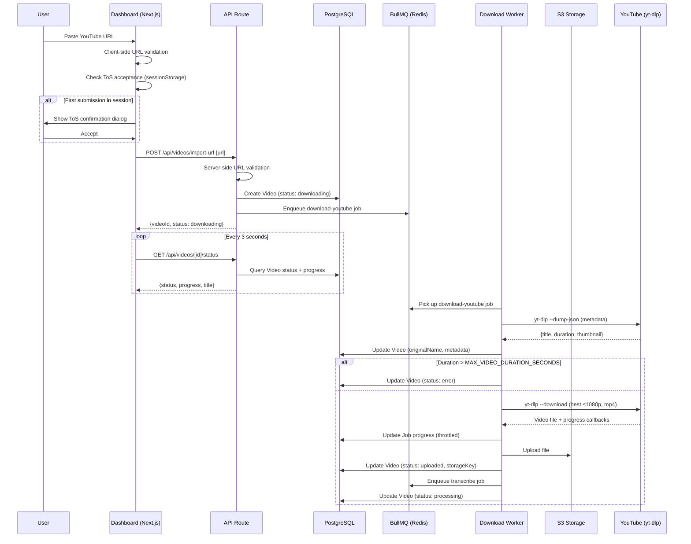
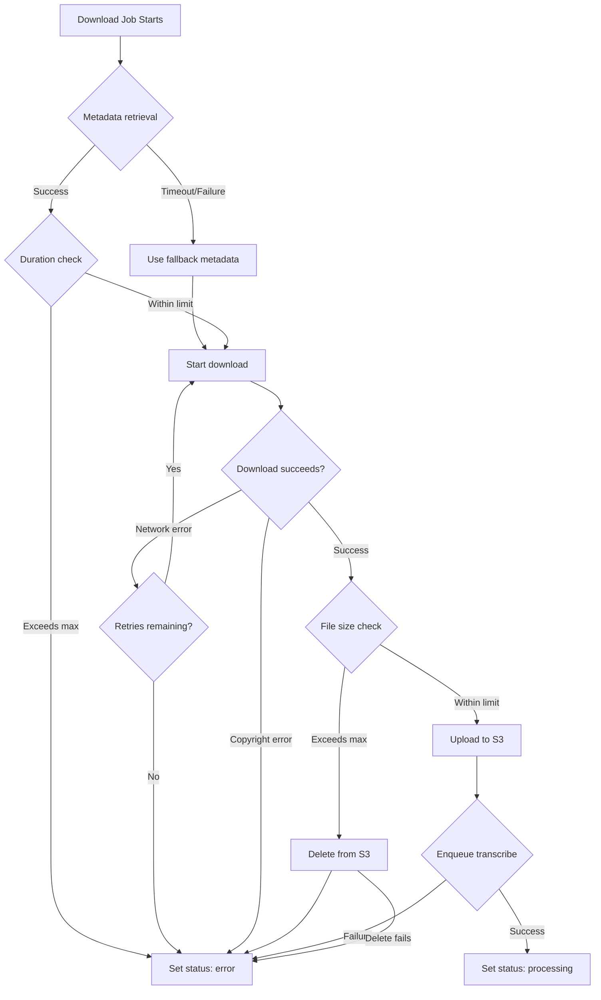

# Design Document: YouTube URL Import

## Overview

The YouTube URL Import feature adds a server-side video download capability to ClipAI, allowing users to paste a YouTube URL in the dashboard and have the system download, store, and process the video through the existing AI pipeline. The design introduces a new `download-youtube` BullMQ job type, a URL validation module, a new API endpoint, and UI components for URL input and download progress tracking.

The architecture follows the existing patterns: the web app handles validation and record creation, enqueues a job, and the worker processes it asynchronously. Once downloaded, the video enters the same Transcribe → Detect Highlights → Generate Captions → Render Clip pipeline as directly uploaded videos.

### Key Design Decisions

1. **yt-dlp as a subprocess**: Rather than using a Node.js YouTube library, we shell out to `yt-dlp` (already proven, actively maintained, handles format negotiation and DRM-free downloads). This requires `yt-dlp` and Python to be available in the worker container.

2. **New `downloading` VideoStatus**: A dedicated status distinguishes YouTube imports mid-download from other states, enabling the UI to show download-specific progress.

3. **New `download_youtube` JobType**: A dedicated job type keeps the download logic isolated and allows independent concurrency/retry configuration.

4. **Client-side URL pre-validation**: The URL format is validated on the client before hitting the API, providing instant feedback. The server re-validates to prevent bypasses.

5. **Polling for progress**: The dashboard polls a video status endpoint every 3 seconds during download. This is simpler than SSE/WebSockets and sufficient given the polling interval aligns with yt-dlp's progress reporting granularity.

6. **Session-based ToS acceptance**: The disclaimer acceptance is stored in `sessionStorage` to avoid repeated prompts within a browser session while requiring re-acceptance on new sessions.

## Architecture



### Component Placement

| Component | Location | Responsibility |
|-----------|----------|----------------|
| `YouTubeUrlInput` | `apps/web/components/video/youtube-url-input.tsx` | URL input field, client validation, ToS dialog |
| `DownloadProgress` | `apps/web/components/video/download-progress.tsx` | Progress bar, polling, status transitions |
| URL Validator | `packages/types/src/youtube-url.ts` | Shared URL parsing/validation (used by both client and server) |
| Import API Route | `apps/web/app/api/videos/import-url/route.ts` | Server validation, Video creation, job enqueue |
| Status API Route | `apps/web/app/api/videos/[id]/status/route.ts` | Return video status, progress, metadata |
| Download Job | `apps/worker/src/jobs/download-youtube.job.ts` | yt-dlp execution, S3 upload, pipeline handoff |
| Queue Setup | `apps/worker/src/queue/setup.ts` | Register new queue + worker |

## Components and Interfaces

### 1. YouTube URL Validator (`packages/types/src/youtube-url.ts`)

A pure, shared module used by both the web app (client-side pre-validation) and the API route (server-side validation).

```typescript
export interface YouTubeValidationSuccess {
  valid: true;
  videoId: string;
  normalizedUrl: string;
}

export interface YouTubeValidationError {
  valid: false;
  error: {
    code: 'INVALID_URL';
    message: string;
  };
}

export type YouTubeValidationResult = YouTubeValidationSuccess | YouTubeValidationError;

/**
 * Validates and parses a YouTube URL, extracting the video ID.
 * Supports: youtube.com/watch?v=, youtu.be/, youtube.com/shorts/, youtube.com/embed/
 * With or without protocol prefix, www. subdomain, and extra query params.
 */
export function validateYouTubeUrl(input: string | null | undefined): YouTubeValidationResult;

/**
 * Regex pattern for YouTube video IDs: exactly 11 chars of [a-zA-Z0-9_-]
 */
export const YOUTUBE_VIDEO_ID_PATTERN: RegExp;
```

### 2. Import API Route (`apps/web/app/api/videos/import-url/route.ts`)

```typescript
// POST /api/videos/import-url
// Request body:
interface ImportUrlRequest {
  url: string;
}

// Response (success):
interface ImportUrlResponse {
  success: true;
  data: {
    videoId: string;
    status: 'downloading';
    message: string;
  };
}

// Response (error):
interface ImportUrlErrorResponse {
  success: false;
  error: {
    code: 'INVALID_URL' | 'INTERNAL_ERROR';
    message: string;
  };
}
```

**Behavior:**
1. Parse request body, extract `url`
2. Call `validateYouTubeUrl(url)` — return 400 if invalid
3. Create Video record: `status: 'downloading'`, `originalName: videoId`, `storageKey: uploads/{videoId}/original.mp4`, `metadata: { sourceUrl: url }`
4. Create Job record: `type: 'download_youtube'`, `status: 'waiting'`, `payload: { videoId, url, videoIdYt }`
5. Return `{ videoId, status: 'downloading' }`

### 3. Video Status API Route (`apps/web/app/api/videos/[id]/status/route.ts`)

```typescript
// GET /api/videos/:id/status
// Response:
interface VideoStatusResponse {
  success: true;
  data: {
    id: string;
    status: VideoStatus;
    progress: number;       // 0-100, from active Job record
    originalName: string;
    error: string | null;
    metadata: {
      sourceUrl?: string;
      duration?: number;
      thumbnailUrl?: string;
    } | null;
  };
}
```

### 4. Download YouTube Job (`apps/worker/src/jobs/download-youtube.job.ts`)

```typescript
interface DownloadYouTubePayload {
  videoId: string;       // ClipAI Video record ID
  url: string;           // Full YouTube URL
  videoIdYt: string;     // YouTube video ID (11 chars)
}

interface DownloadYouTubeResult {
  storageKey: string;
  fileSize: number;
  duration: number;
  title: string;
}
```

**Processing Steps:**
1. Retrieve metadata via `yt-dlp --dump-json`
2. Validate duration against `MAX_VIDEO_DURATION_SECONDS`
3. Update Video record with title, duration, thumbnail
4. Download video via `yt-dlp -f "bestvideo[height<=1080]+bestaudio/best[height<=1080]" --merge-output-format mp4`
5. Validate file size against `MAX_FILE_SIZE_MB`
6. Upload to S3 at `uploads/{videoId}/original.mp4`
7. Update Video status to `uploaded`
8. Enqueue transcribe job
9. Update Video status to `processing`
10. Clean up temp files

### 5. UI Components

**`YouTubeUrlInput`**: A controlled input with paste/type support, inline validation feedback, submit button, and Enter key handler. Renders the ToS disclaimer text below the input. On first submission per session, shows a confirmation dialog.

**`DownloadProgress`**: Displays when a video has `status: 'downloading'`. Shows a progress bar (0-100%), video title (or URL as fallback), and transitions to "Processing..." when status changes to `processing`. Polls `GET /api/videos/[id]/status` every 3 seconds.

## Data Models

### Schema Changes

#### 1. Add `downloading` to `VideoStatus` enum

```prisma
enum VideoStatus {
  uploading
  uploaded
  downloading   // NEW
  processing
  transcribing
  analyzing
  ready
  error
}
```

#### 2. Add `download_youtube` to `JobType` enum

```prisma
enum JobType {
  transcribe
  detect_highlights
  generate_captions
  render_clip
  generate_preview
  extract_keyframes
  analyze_keyframes
  download_youtube   // NEW
}
```

#### 3. Video Record Metadata Shape (for YouTube imports)

The existing `metadata` JSON field on the Video model stores:

```typescript
interface YouTubeVideoMetadata {
  sourceUrl: string;           // Original YouTube URL (max 2048 chars)
  duration?: number;           // Video duration in seconds
  thumbnailUrl?: string;       // YouTube thumbnail URL
}
```

The `originalName` field stores the video title (truncated to 255 chars) once metadata is retrieved, falling back to the YouTube video ID.

### TypeScript Type Updates

#### `packages/types/src/video.ts`

Add `'downloading'` to the `VideoStatus` union type.

#### `packages/types/src/job.ts`

Add `'download-youtube'` to the `JobType` union and corresponding entries in `JobPayloadMap` and `JobResultMap`.

#### `packages/database/src/enums.ts`

Add `download_youtube` to `PrismaJobType` and `'download-youtube'` mapping.

### Environment Variables

| Variable | Default | Description |
|----------|---------|-------------|
| `MAX_VIDEO_DURATION_SECONDS` | `10800` (180 min) | Maximum allowed YouTube video duration |
| `MAX_FILE_SIZE_MB` | `500` | Maximum downloaded file size in MB |
| `YTDLP_PATH` | `yt-dlp` | Path to yt-dlp binary |
| `YTDLP_COOKIES_PATH` | (none) | Optional path to cookies file for authenticated downloads |

### Docker Changes

The worker Dockerfile needs `yt-dlp` and Python installed:

```dockerfile
# In the runner stage, after FFmpeg:
RUN apk add --no-cache python3 py3-pip && \
    pip3 install --break-system-packages yt-dlp
```


## Correctness Properties

*A property is a characteristic or behavior that should hold true across all valid executions of a system — essentially, a formal statement about what the system should do. Properties serve as the bridge between human-readable specifications and machine-verifiable correctness guarantees.*

### Property 1: URL validation round-trip (valid URLs produce correct video ID)

*For any* valid 11-character YouTube video ID (composed of `[a-zA-Z0-9_-]`) and *for any* supported URL format variant (youtube.com/watch?v=, youtu.be/, youtube.com/shorts/, youtube.com/embed/, with or without `https://`, `http://`, or `www.`, and with or without additional query parameters), calling `validateYouTubeUrl` on the constructed URL SHALL return a success result where the extracted `videoId` equals the original video ID and `normalizedUrl` is a well-formed YouTube URL containing that video ID.

**Validates: Requirements 2.1, 2.2, 2.4, 2.5, 2.7**

### Property 2: Invalid input rejection

*For any* string that does not conform to a valid YouTube URL (including empty strings, whitespace-only strings, non-URL text, URLs from other domains, and YouTube-format URLs with malformed video IDs that are not exactly 11 characters of `[a-zA-Z0-9_-]`), calling `validateYouTubeUrl` SHALL return an error result with code `INVALID_URL`.

**Validates: Requirements 1.4, 2.3, 2.6, 2.8**

### Property 3: Duration threshold enforcement

*For any* video metadata where the duration in seconds exceeds the configured `MAX_VIDEO_DURATION_SECONDS` threshold, the download worker SHALL reject the download and set the Video record status to `error` without writing any file to S3 storage. Conversely, *for any* duration at or below the threshold, the download SHALL proceed.

**Validates: Requirements 3.8, 6.3**

### Property 4: File size threshold enforcement

*For any* downloaded file whose size in bytes exceeds `MAX_FILE_SIZE_MB * 1024 * 1024`, the download worker SHALL delete the file from S3 storage and set the Video record status to `error`. The error status update SHALL succeed regardless of whether the S3 deletion succeeds or fails.

**Validates: Requirements 6.6, 6.7**

### Property 5: Title truncation preserves prefix

*For any* string used as a video title, the stored `originalName` SHALL be at most 255 characters long. If the original title is longer than 255 characters, the stored value SHALL equal the first 255 characters of the original title. If the original title is 255 characters or fewer, the stored value SHALL equal the original title exactly.

**Validates: Requirements 8.2**

## Error Handling

### Error Categories and Responses

| Error Source | Error Code | HTTP Status | User Message | Recovery |
|---|---|---|---|---|
| Invalid URL format | `INVALID_URL` | 400 | "Not a recognized YouTube video link. Please use a youtube.com or youtu.be URL." | User corrects URL |
| Video unavailable (deleted/private/restricted) | `VIDEO_UNAVAILABLE` | — | "This video is unavailable. It may be deleted, private, or region-restricted." | User tries different URL |
| Copyright restriction | `COPYRIGHT_RESTRICTED` | — | "This video cannot be downloaded due to copyright restrictions." | User tries different URL |
| Duration exceeded | `DURATION_EXCEEDED` | — | "This video exceeds the maximum allowed duration of {max} minutes." | User tries shorter video |
| File size exceeded | `FILE_TOO_LARGE` | — | "The downloaded file exceeds the {max}MB size limit." | User tries different video |
| Network failure (after retries) | `NETWORK_ERROR` | — | "Download failed due to a network error. Please try again later." | User retries |
| yt-dlp not available | `INTERNAL_ERROR` | 500 | "An internal error occurred. Please try again later." | Ops fixes worker |
| Queue enqueue failure | `INTERNAL_ERROR` | — | "Failed to start processing. The downloaded video has been preserved." | System retry or manual trigger |

### Retry Strategy

- **Download job retries**: 3 attempts with exponential backoff (5s, 10s, 20s) — configured via BullMQ job options
- **Database write retries**: 3 attempts with exponential backoff (1s, 2s, 4s) — handled by `PersistenceService.withRetry()`
- **S3 upload retries**: Handled by AWS SDK built-in retry (3 attempts)
- **Metadata retrieval timeout**: 15 seconds, then proceed with fallback values

### Error Flow



### Cleanup on Failure

- Temp files are always cleaned up in a `finally` block regardless of success/failure
- If S3 upload partially completes before a size check fails, the partial object is deleted
- If S3 deletion fails during cleanup, the error is logged but does not block the status update to `error`

## Testing Strategy

### Property-Based Tests (fast-check)

Property-based tests use [fast-check](https://github.com/dubzzz/fast-check) with a minimum of 100 iterations per property. Tests are placed in `packages/types/__tests__/property/` for the URL validator and `apps/worker/__tests__/property/` for worker logic.

| Property | Test File | What It Validates |
|----------|-----------|-------------------|
| Property 1: URL round-trip | `packages/types/__tests__/property/youtube-url.prop.ts` | Valid URLs always produce correct video ID |
| Property 2: Invalid rejection | `packages/types/__tests__/property/youtube-url.prop.ts` | Invalid inputs always return INVALID_URL |
| Property 3: Duration threshold | `apps/worker/__tests__/property/download-youtube.prop.ts` | Duration check correctly gates downloads |
| Property 4: File size threshold | `apps/worker/__tests__/property/download-youtube.prop.ts` | Size check triggers cleanup + error |
| Property 5: Title truncation | `apps/worker/__tests__/property/download-youtube.prop.ts` | Titles are correctly truncated to 255 chars |

**Tag format**: `Feature: youtube-url-import, Property {N}: {description}`

### Unit Tests (vitest)

| Area | Test File | Coverage |
|------|-----------|----------|
| URL Validator | `packages/types/__tests__/unit/youtube-url.test.ts` | Specific URL examples, edge cases |
| Import API Route | `apps/web/__tests__/unit/import-url.test.ts` | Request validation, response shapes |
| Download Job | `apps/worker/__tests__/unit/download-youtube.test.ts` | yt-dlp argument construction, progress parsing |
| UI Components | `apps/web/__tests__/unit/youtube-url-input.test.ts` | Render states, user interactions |

### Integration Tests

| Area | Test File | Coverage |
|------|-----------|----------|
| Import API → DB | `apps/web/__tests__/integration/import-url.test.ts` | Video record creation, job enqueue |
| Download → Pipeline | `apps/worker/__tests__/integration/download-pipeline.test.ts` | Full flow: download → upload → transcribe enqueue |
| Status Polling | `apps/web/__tests__/integration/video-status.test.ts` | Status endpoint returns correct progress |

### Test Configuration

```typescript
// vitest.config.ts additions
export default defineConfig({
  test: {
    // Property tests need longer timeout due to 100+ iterations
    testTimeout: 30_000,
  },
});
```

### What Is NOT Tested with PBT

- **yt-dlp behavior**: External tool, tested via integration tests with mocked subprocess
- **S3 upload/download**: Infrastructure, tested via integration tests with MinIO
- **BullMQ job lifecycle**: Framework behavior, tested via integration tests
- **UI rendering**: Tested with component unit tests (React Testing Library)
- **Polling mechanism**: Tested with timer mocks in unit tests
